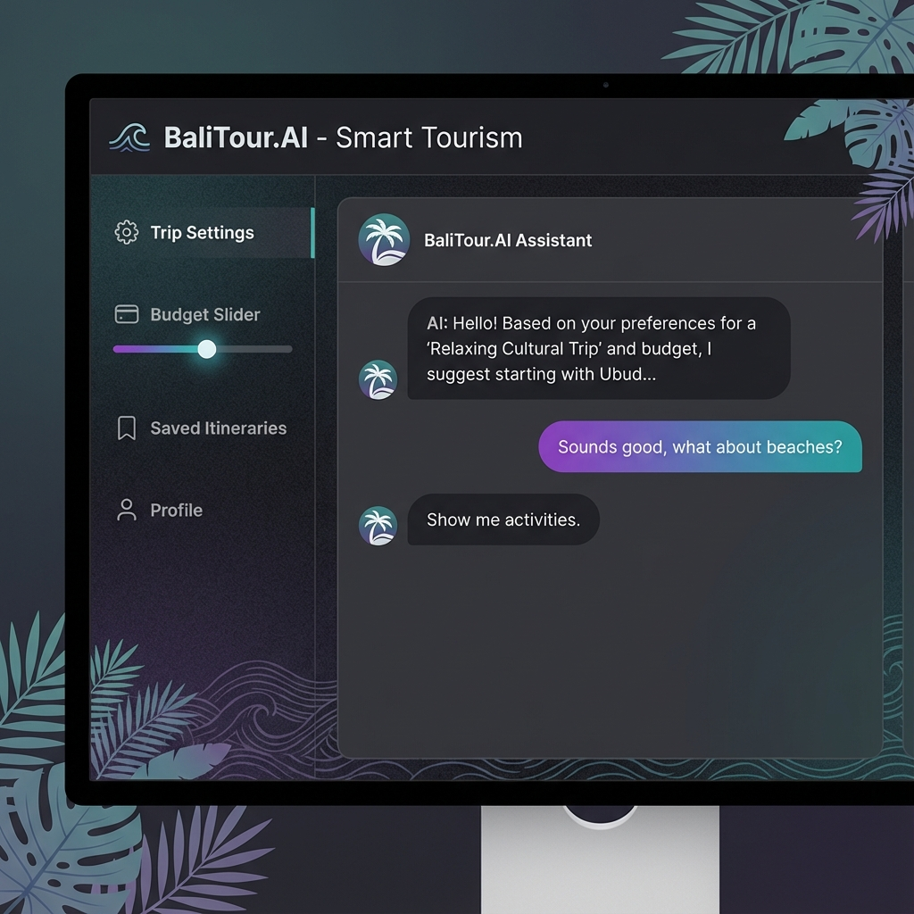
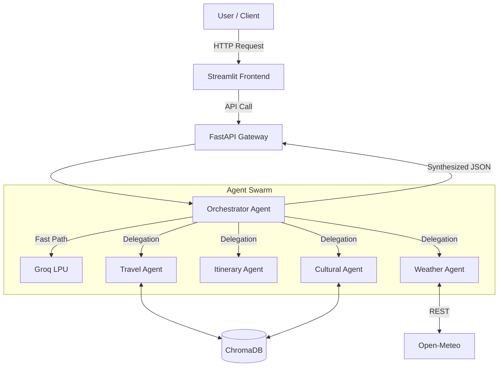

<div align="center">

# 🌺 BaliTour.AI

### Agentic AI Platform for Smart Tourism in Bali

[](https://www.python.org/)
[](https://fastapi.tiangolo.com/)
[](https://developers.google.com/agents)
[](https://groq.com/)
[](https://www.trychroma.com/)
[](https://opensource.org/licenses/MIT)

*An intelligent multi-agent ecosystem designed to revolutionize the Bali tourism experience.*

[Features](#-key-features) • [Preview](#-preview) • [Architecture](#-system-architecture) • [Getting Started](#-getting-started) • [Contributing](#-contributing)

</div>

***

## 📖 Project Overview

**BaliTour.AI** is a cutting-edge **Agentic AI Platform** that empowers tourists and local tourism operators in Bali. By leveraging a sophisticated multi-agent system, the platform provides hyper-personalized travel recommendations, dynamic itinerary generation, real-time environmental safety updates, and deep cultural insights.

Built on the **Google ADK (Agent Developer Kit)** and powered by **Groq's LPU** for ultra-low latency inference, BaliTour.AI ensures a seamless and responsive user experience. **ChromaDB** serves as the intelligent backbone, enabling RAG (Retrieval-Augmented Generation) for accurate, context-aware interactions.

***

## 📱 Preview



***

## 🚀 Key Features

### 🌟 Intelligent Agents

| Agent | Functionality |
| :--- | :--- |
| **🧠 Supervisor (Orchestrator)** | The central brain. Uses "Fast Path" to answer simple chats instantly and routes complex tasks to specialized agents. |
| **🌍 Travel Recommendation** | Suggests destinations based on location, category (cultural, culinary, nature), and user persona via RAG. |
| **📅 Itinerary Generator** | Creates smart 1-7 day itineraries. Adjusts for "Relaxed", "Adventure", or "Cultural" travel styles. |
| **🌦️ Weather & Marine** | Real-time safety updates via **Open-Meteo** (weather) and **StormGlass** (waves, UV, wind). |
| **🚕 Transport Route** | Optimizes travel routes using **OpenRouteService**. Calculates distance and travel time. |
| **🎭 Cultural Guide** | Your personal guide to Balinese etiquette, beliefs, and upcoming ceremonies. |

### 🤖 Multi-Agent Collaboration

Our agents don't work in silos. They communicate to deliver a unified experience:

> *"The Weather Agent warns of high waves 🌊 → The Itinerary Agent reschedules the beach visit 🏖️ → The Cultural Agent suggests a nearby indoor temple ceremony instead 🕍."*

***

## 🛠️ Technical Stack

<div align="center">

| Component | Tech Stack |
| :--- | :--- |
| **Frontend** | Streamlit (Custom CSS, Modern UI) |
| **Backend** | FastAPI, Uvicorn |
| **AI Engine** | Groq (Llama-3.3-70b-versatile) |
| **Orchestration** | Custom Independent Agents (Google ADK Pattern) |
| **Data & RAG** | ChromaDB (Vector Store) |
| **External APIs** | Open-Meteo, OpenRoute, StormGlass, Travelpayouts |

</div>

***

## 📐 System Architecture



***

## 📂 Directory Structure

```text
bali-tour-ai/
├── app/
│   ├── main.py                 # FastAPI Entry Point
│   ├── orchestrator.py         # Main Agent logic with Intent Classification
│   ├── agents/                 # Specialized Agent Definitions
│   │   ├── weather_agent.py    # Weather & Marine safety
│   │   ├── transport_agent.py  # Routing logic
│   │   ├── culture_agent.py    # Cultural RAG
│   │   └── ...
│   └── services/               # External Service Wrappers
├── assets/                     # Images and static assets
├── data/                       # Local Knowledge Base
├── requirements.txt            # Dependencies
└── .env                        # API Configuration (Use .env.example)
```

***

## 🚦 Getting Started

### Prerequisites

* Python 3.10+
* API Keys for Groq, Google, OpenRouteService.

### Installation

1. **Clone the Repository**
   ```bash
   git clone https://github.com/your-username/balitour-ai.git
   cd balitour-ai
   ```

2. **Set Up Virtual Environment**
   ```bash
   python -m venv venv
   # Windows
   source venv/bin/activate
   # Linux/Mac
   source venv/bin/activate
   ```

3. **Install Dependencies**
   ```bash
   pip install -r requirements.txt
   ```

4. **Configure Environment**
   Rename `.env.example` to `.env` and fill in your keys.
   ```bash
   cp .env.example .env
   ```

5. **Run the Application 🚀**
   You need **two terminal windows**:

   **Terminal 1: Backend API**

   ```bash
   python -m uvicorn app.main:app --host 0.0.0.0 --port 8000 --reload
   ```

   **Terminal 2: Frontend UI**

   ```bash
   python -m streamlit run streamlit_app.py
   ```

   👉 Access the App at: **http://localhost:8501**

***

## 🤝 Contributing

Contributions are welcome!

1. Fork the project
2. Create your feature branch (`git checkout -b feature/AmazingFeature`)
3. Commit your changes (`git commit -m 'Add some AmazingFeature'`)
4. Push to the branch (`git push origin feature/AmazingFeature`)
5. Open a Pull Request

***

## 📄 License

This project is licensed under the MIT License - see the [LICENSE](LICENSE) file for details.

***

<div align="center">
  <sub>Built with ❤️ for Bali by &lt;/cgyudistira&gt;</sub>
</div>
